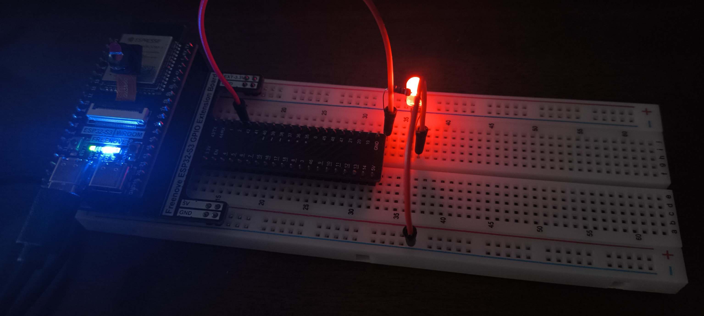
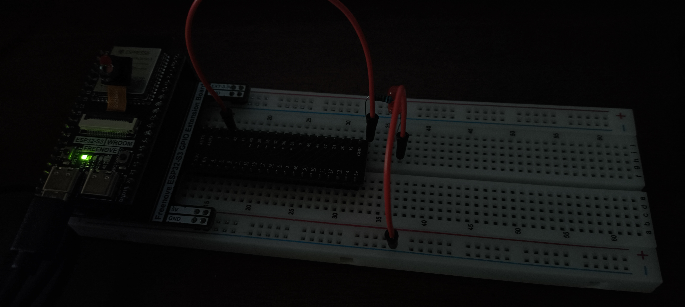

# ESP32 LED Blink

This project is a basic ESP32 example to blink an LED using a GPIO pin.

## 📌 Description
The goal of this project is to get familiar with:
- ESP32 GPIO pins
- Digital output
- Basic Arduino setup

## 🔌 Wiring
The LED is connected to GPIO 2 through a resistor.




🔌 Circuit Connections Explanation
1. Ground Connection (GND)

The wire connects the shorter leg of the LED (the cathode) to the GND (ground) pin of the expansion board.

Why:

Circuit closure:
For electric current to flow, the circuit must be closed. The current leaves the microcontroller pin (high potential), passes through the components, and must return to ground (low potential, 0V).

Forward biasing:
An LED is a diode and it lights up only when it is forward-biased. This means current must enter through the anode (+) and exit through the cathode (−). Connecting the cathode to ground ensures that the output potential is lower than the input potential, allowing correct operation.

2. GPIO 2 and Resistor Connection

A wire connects IO2 (GPIO 2) to a row of the breadboard. On that same row, one terminal of the resistor is connected.
The other terminal of the resistor goes to the longer leg of the LED (the anode).

Why:

Logical control (voltage source):
GPIO 2 acts as a software-controlled voltage source.

When the pin is set to HIGH (logic 1), it outputs 3.3V, allowing current to flow and turning the LED on.

When the pin is set to LOW (logic 0), it outputs 0V, there is no potential difference, and the LED turns off.

Current limiting (resistor):
The resistor is essential. Once an LED’s forward voltage 
𝑉
𝐿
𝐸
𝐷
V
LED
	​

 is exceeded, its internal resistance becomes very small.
Without a resistor, applying Ohm’s law 
𝐼
=
𝑉
/
𝑅
I=V/R with 
𝑅
≈
0
R≈0 would cause a very large current (short circuit), potentially damaging the LED or the microcontroller pin.

Series configuration:
All components are connected in series, so the same current flows through:
Pin → Resistor → LED → GND

The resistor sets the current 
𝐼
I to a safe value (typically between 10 mA and 20 mA) according to the formula:

𝐼
=
3.3
𝑉
−
𝑉
𝐿
𝐸
𝐷
𝑅
I=
R
3.3V−V
LED
	​

	​

🔎 Why GPIO 2 Is Often Used (and Its Constraints)
Practical reason: the on-board LED

On most ESP32 development boards (including the classic version), GPIO 2 is physically connected to an on-board blue LED.

Advantage:
When you set GPIO 2 to HIGH, both the external LED on the breadboard and the on-board LED light up.
This is extremely useful for debugging:

If the on-board LED turns on but the external one does not, the issue is likely in the wiring (loose wire, reversed LED), not in the code.

Constraints:
GPIO 2 is a strapping pin, meaning it is read during boot to determine the ESP32 startup mode.
However, connecting an LED with a resistor to ground is usually safe because it behaves as a weak pull-down, which often matches the required default state.


## 💻 Code

```cpp
#define LED_PIN 2        //2 is the IO2

void setup() {
  pinMode(LED_PIN, OUTPUT);
}

void loop() {
  digitalWrite(LED_PIN, HIGH);        // turn the LED on (HIGH is the voltage level)
  delay(1000);                        // wait for a second
  digitalWrite(LED_PIN, LOW);          // turn the LED low by making the voltage low
  delay(1000);                        // wait for a second
}

